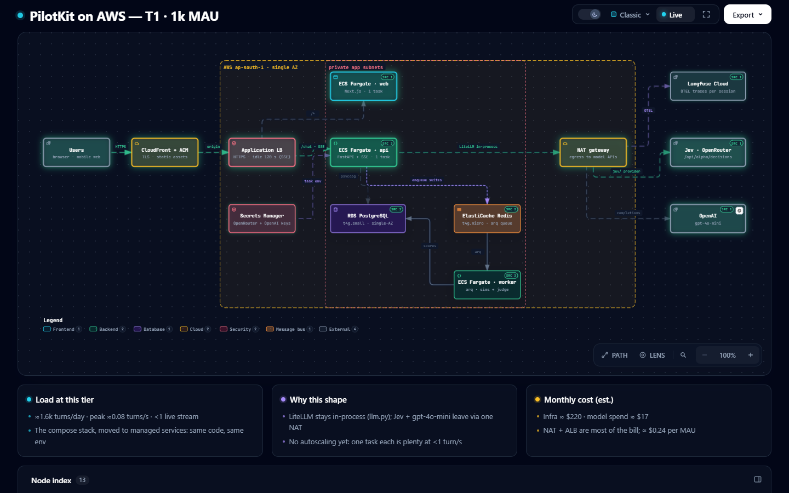
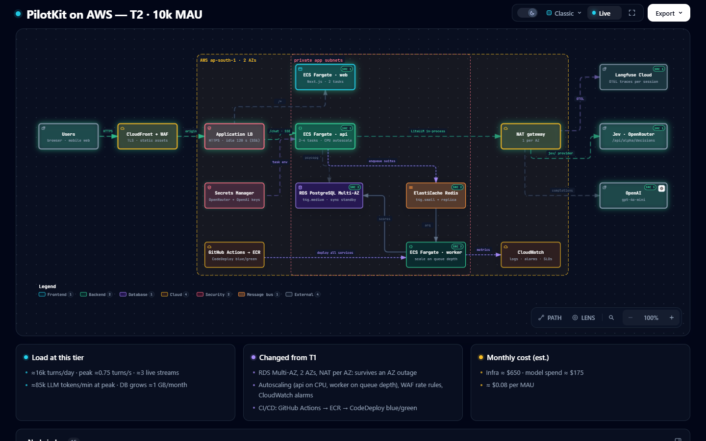
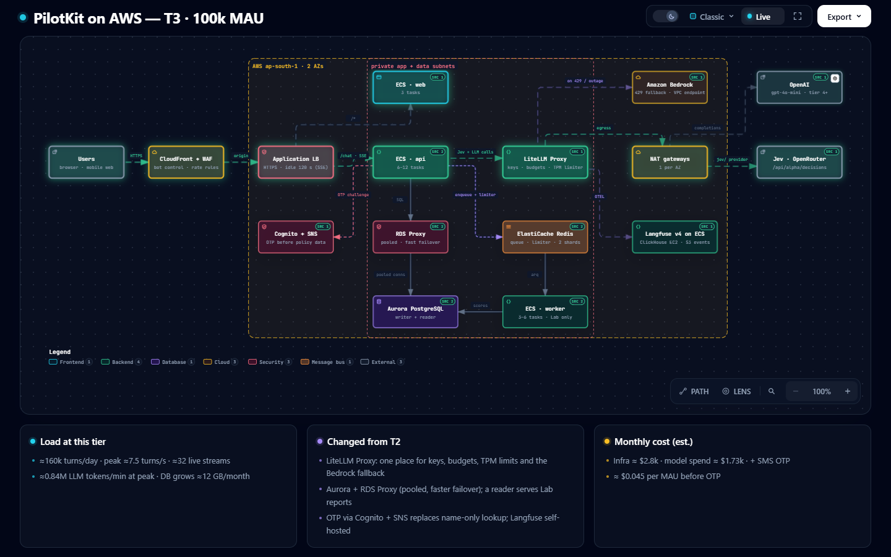
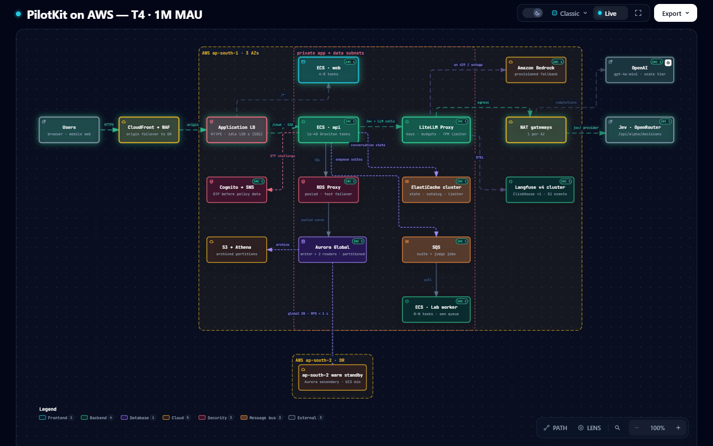
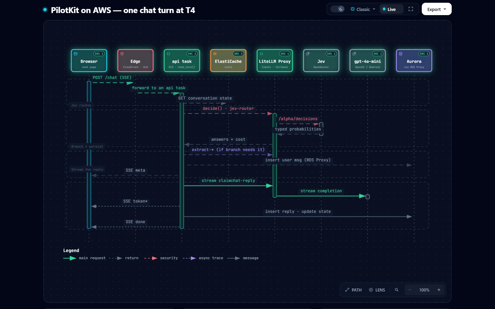
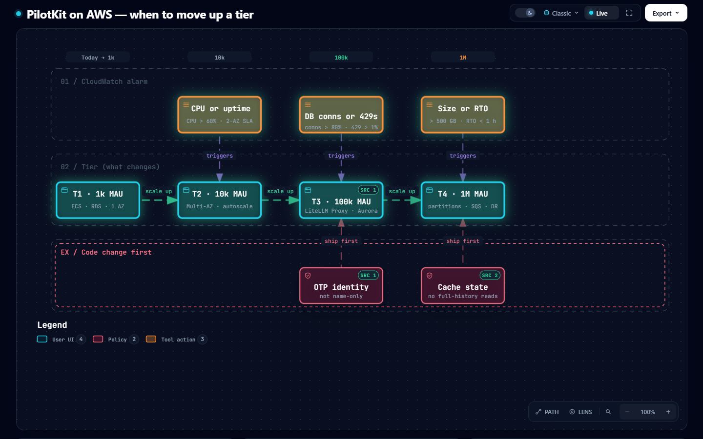

# PilotKit on AWS: 1k → 1M active users

How the CoverWise assistant and Test Lab run on AWS at four sizes. It starts with the Docker Compose stack from today, moved onto managed services, and ends with a multi-AZ, DR-ready setup for 1M monthly active users.

This is a design document. No infrastructure-as-code exists yet, and the application code is unchanged; the [code changes](#code-changes-each-tier-needs) each tier needs are listed at the end. Every diagram is an interactive Archify page with a trace-animation recording. Each node's `SRC` badge points at the repo code that component runs or replaces, verified at commit `6c0aabe`.

| Tier | MAU | Diagram | Recording |
|---|---|---|---|
| T1 | 1k | [architecture](diagrams/architecture-pilotkit-aws-t1-1k-20260930-000203/pilotkit-aws-t1-1k.html) | [webm](diagrams/architecture-pilotkit-aws-t1-1k-20260930-000203/pilotkit-aws-t1-1k.webm) |
| T2 | 10k | [architecture](diagrams/architecture-pilotkit-aws-t2-10k-20260930-000203/pilotkit-aws-t2-10k.html) | [webm](diagrams/architecture-pilotkit-aws-t2-10k-20260930-000203/pilotkit-aws-t2-10k.webm) |
| T3 | 100k | [architecture](diagrams/architecture-pilotkit-aws-t3-100k-20260930-000203/pilotkit-aws-t3-100k.html) | [webm](diagrams/architecture-pilotkit-aws-t3-100k-20260930-000203/pilotkit-aws-t3-100k.webm) |
| T4 | 1M | [architecture](diagrams/architecture-pilotkit-aws-t4-1m-20260930-000203/pilotkit-aws-t4-1m.html) | [webm](diagrams/architecture-pilotkit-aws-t4-1m-20260930-000203/pilotkit-aws-t4-1m.webm) |
| — | when to move up | [workflow](diagrams/workflow-pilotkit-aws-scaling-20260930-000203/pilotkit-aws-scaling.html) | [webm](diagrams/workflow-pilotkit-aws-scaling-20260930-000203/pilotkit-aws-scaling.webm) |
| T4 | one chat turn | [sequence](diagrams/sequence-pilotkit-aws-chat-turn-20260930-000203/pilotkit-aws-chat-turn.html) | [webm](diagrams/sequence-pilotkit-aws-chat-turn-20260930-000203/pilotkit-aws-chat-turn.webm) |

## Assumptions
- **Active users = MAU.** 20% are active on a given day (DAU/MAU), with 1.5 chat sessions per active day.
- **Peak = 4× the daily average.** Traffic concentrates in Indian business hours. Each tier is designed for 2× that peak.
- **Region `ap-south-1` (Mumbai), DR in `ap-south-2` (Hyderabad).** CoverWise is an Indian broker (INR prices, a policybazaar.com catalog), so customer data stays in India. Plan for IRDAI data-localisation and outsourcing rules and confirm them with compliance. Both regions are in India.
- **Prices are rough, on-demand `ap-south-1` figures (±30%).** They exclude tax, support plans and Savings Plans (the latter take 20–40% off compute). Check them in the AWS Pricing Calculator before committing to a budget.

## Load model (measured, then projected)
The per-turn inputs come from this repo's own data: 343 production-prompt turns, 386 Jev router calls and 72 simulated conversations in PilotKit's Postgres, plus the Langfuse generations of those runs.

| Measured | Value |
|---|---|
| Turns per conversation | 5.36 |
| Full reply latency (SSE, `message.latency_ms`) | p50 2.37 s · p95 4.23 s |
| Jev router call (`_meta.latency_ms`) | p50 0.37 s · p95 0.79 s · $0.0000494 |
| Tokens per Jev router call (Langfuse) | ≈ 810–860 in · 140 out |
| Bot spend per turn (Jev + gpt-4o-mini) | $0.000359, of which the LLM is $0.000309 ≈ 1.9k gpt-4o-mini tokens |
| Storage per turn | 2 `message` rows ≈ 800 B each, ≈ 2.4 KB with indexes |
| Test Lab suite (9 personas) | ≈ $0.02 per run (bot + judge); not user-driven |

**Projection:** turns/day = MAU × 0.2 × 1.5 × 5.36. Peak turns/s = 4 × turns/day ÷ 86,400. Live SSE streams = peak turns/s × 4.23 s (p95).

| | T1 · 1k | T2 · 10k | T3 · 100k | T4 · 1M |
|---|---|---|---|---|
| Turns / day | 1.6k | 16k | 161k | 1.61M |
| Peak turns / s | 0.07 | 0.74 | 7.4 | 74 (design 150) |
| Live SSE streams at peak | < 1 | ≈ 3 | ≈ 32 | ≈ 315 |
| gpt-4o-mini tokens / min at peak | 8.4k | 84k | 840k | 8.4M |
| Jev requests / s at peak | 0.08 | 0.8 | 7.8 | 78 |
| DB writes / s at peak (2 inserts + 1 update per turn) | < 1 | ≈ 2 | ≈ 22 | ≈ 220 |
| DB growth / month | 0.1 GB | 1.2 GB | 12 GB | 116 GB |
| **Model spend / month** | **$17** | **$173** | **$1.73k** | **$17.3k** |
| **Infra / month (est.)** | **≈ $220** | **≈ $650** | **≈ $2.8k** | **≈ $11k** |
| Total per MAU | $0.24 | $0.08 | $0.045 | $0.028 |

Three things follow from this:
- The hot path is **network-bound, not CPU-bound**. An api task spends a turn waiting on Jev and OpenAI. Even at 1M MAU there are only ≈315 concurrent streams.
- **Model spend overtakes infra between T3 and T4.** At T4 the biggest cost lever is tokens, not instances; see [cost levers](#cost-levers).
- **The Jev call is cheap** (≈14% of per-turn spend) **but sits on the critical path.** Its rate limits matter more than its price.

## T1 · 1k MAU: the compose stack, managed


The same containers and env vars as `docker-compose.yml`, on managed services:

| Component | AWS | Size |
|---|---|---|
| Edge | CloudFront + ACM (TLS), Route 53 | static assets cached, `/chat` not cached |
| Load balancer | Application Load Balancer | idle timeout 120 s so SSE streams aren't cut |
| web, api, worker | ECS Fargate, 1 task each | 0.5 vCPU / 1 GB (api 1 vCPU / 2 GB) |
| Postgres | RDS PostgreSQL 17, single-AZ | db.t4g.small, 20 GB gp3, 7-day backups |
| Redis (arq queue) | ElastiCache Redis/Valkey | cache.t4g.micro |
| Keys | Secrets Manager → ECS task env | `OPENROUTER_API_KEY`, `OPENAI_API_KEY`, Langfuse keys |
| Model egress | 1 NAT gateway | LiteLLM stays **in-process** (`app/llm.py`) |
| Tracing | Langfuse Cloud (or one small ECS task) | unchanged `langfuse_otel` callback |

NAT, the ALB and Fargate make up most of the ≈ $220; the models cost ≈ $17. One task each covers < 1 turn/s. The risks are single points of failure: one AZ, and one DB instance without a standby.

## T2 · 10k MAU: survive an AZ, scale on signals


What changes from T1:
- **Two AZs everywhere:** RDS Multi-AZ (db.t4g.medium, synchronous standby, 1–2 min failover), a NAT per AZ, and tasks spread across AZs.
- **Autoscaling:** api scales on CPU and ALB active connections (min 2 tasks, max 4). The worker scales on arq queue depth (min 1, max 3).
- **WAF on CloudFront:** managed rule groups, a rate rule on `/chat` per IP, and bot control for the public assistant.
- **Operations:**
  - CloudWatch Logs, dashboards and alarms (see [SLOs](#observability-and-slos)).
  - GitHub Actions → ECR → CodeDeploy blue/green for all three services.
  - RDS snapshots with point-in-time recovery.
- **Model limits:** make sure the OpenAI project's usage tier covers ≈ 85k TPM with headroom.

## T3 · 100k MAU: one gateway, pooled data, real identity


What changes from T2:
- **LiteLLM Proxy as a gateway service** (ECS, 2+ tasks). The api and worker call it instead of the providers. The code change is small: `llm.acall()` already routes every Jev and LLM call through one function, so it only needs an `api_base`. The gateway brings:
  - one place for provider keys
  - per-route budgets
  - a Redis-backed TPM/RPS limiter shared by all tasks
  - retries
  - **fallback to Amazon Bedrock** (Claude Haiku or Nova Lite, through a VPC endpoint) when OpenAI returns 429 or goes down
- **The `jev/` custom provider moves into the proxy config.** `JEV_FALLBACK=1` remains the Jev circuit breaker for the alpha Decisions API.
- **Aurora PostgreSQL + RDS Proxy.**
  - RDS Proxy pools connections across 6–12 api tasks and the workers. Each process holds its own `psycopg` pool (`app/db.py:11`).
  - It also cuts failover time.
  - A reader instance serves Test Lab reports and compare queries, so dashboards never load the writer.
- **Customer identity with OTP.** Cognito (or a small OTP service) plus SNS SMS replaces the name-only lookup in `n_identify` (`app/bot.py:174-206`) **before** real customer traffic. A name is not a secret. The `ponytail:` note at `bot.py:186` names this ceiling.
  - SMS is priced per message. At ≈ 30% of sessions that's ≈ 270k SMS a month. Price it with the SNS India rates, or use WhatsApp or email OTP.
- **Self-hosted Langfuse v4** on ECS (web + worker) with ClickHouse on EC2 and S3 for events. Langfuse Cloud pricing is per event, and T3 emits ≈ 15M generations a month.
- **ElastiCache Redis with 2 shards** for the arq queue, the gateway limiter and, from T4, conversation state.

## T4 · 1M MAU: partitioned data, isolated Lab, DR


What changes from T3:
- **api on Graviton ECS**, 16–40 tasks, sized for 150 turns/s with 2× headroom.
  - Each 1 vCPU / 2 GB task handles ≈ 50 concurrent turns, because they are I/O-bound.
  - Use an ECS capacity provider on EC2 (Savings Plans) for the base load and Fargate Spot for the worker.
- **Conversation state in ElastiCache.** Today `chat_turn()` re-reads the whole message history from Postgres on every turn (`app/bot.py:407-412`). At T4 the api reads memory and the last 12 messages from Redis, writes through to Aurora, and falls back to the reader on a miss.
- **Aurora Global Database:** a writer and 2 readers in `ap-south-1`, and a secondary cluster in `ap-south-2` (RPO < 1 s, promotion in minutes).
  - The `message` table is partitioned by month (`pg_partman`); partitions older than 12 months are exported to S3 and queried with Athena.
  - Plan for ≈ 1.4 TB of hot data per year.
- **Test Lab on SQS with its own worker pool**, scaling from 0 to N. Suites and judging never compete with live chat for api tasks, DB connections or TPM budget. Tag them as their own route in the gateway budget.
- **Warm standby in `ap-south-2`:** ECR replication, an ECS service at minimum capacity, and a CloudFront origin group that fails over to the DR ALB.
  - Target RTO < 1 h, RPO < 1 s.
  - Run a game day every quarter.
- **Model capacity:**
  - gpt-4o-mini peaks at ≈ 8.4M TPM (17M with headroom): negotiate the OpenAI tier or scale tier, and keep Bedrock provisioned throughput as the fallback.
  - **Jev peaks at ≈ 80 req/s.** Confirm OpenRouter's limits for `typesafe/jev-1.13` in writing before T4; this is the one external limit with no second supplier.
- **Langfuse at scale:** a 3-node ClickHouse cluster and S3 event storage, with retention policies.
  - Keep 100% of live-chat traces; they are the audit trail for every Jev decision.
  - Sample simulated Test Lab traffic with the OTEL `traceidratio` sampler on the worker.

## One chat turn at T4


Latency budget, using the measured numbers above:

| Step | p50 | p95 | Notes |
|---|---|---|---|
| Edge + ALB | ≈ 20 ms | ≈ 50 ms | CloudFront PoPs in India |
| State read | ≈ 2 ms | ≈ 5 ms | ElastiCache instead of a full-history SQL read |
| Jev router | 366 ms | 794 ms | 5 questions in one call |
| Branch (extract, lookup) | 0–600 ms | ≈ 1 s | only on identify, claim and shop turns |
| First token | ≈ 0.9 s | ≈ 1.5 s | **SLO target** |
| Full reply | 2.37 s | 4.23 s | tokens streamed as they arrive |
| Langfuse export | — | — | batched OTEL, off the hot path |

## When to move up a tier


Scale on alarms, not on MAU counts:

| Move | Trigger (sustained 15 min, or a business requirement) | Ship first |
|---|---|---|
| T1 → T2 | api CPU > 60%, or a 2-AZ availability commitment | — |
| T2 → T3 | DB connections > 80% · OpenAI 429 rate > 1% · p95 first token > 1.5 s | OTP identity |
| T3 → T4 | `message` > 500 GB or writer IOPS saturating · an RTO < 1 h requirement | Conversation-state cache |

## Cross-cutting

### Security and compliance
- **Network:** a VPC with public subnets (ALB, NAT) and private app and data subnets. There are no public IPs on tasks or databases. Security groups are scoped per service. VPC endpoints serve S3, ECR, Secrets Manager, CloudWatch and Bedrock, which keeps that traffic off the NAT.
- **Encryption:** KMS keys for RDS/Aurora, ElastiCache, S3 and Secrets Manager, with secret rotation. TLS everywhere (ACM).
- **PII:**
  - Card and ID numbers are already redacted before storage when Jev's `pii_overshare` ≥ 0.7.
  - Policy numbers stay masked in cards and in the prompt.
  - Keep Langfuse in-region and in the private subnet from T3 on, because traces contain chat text.
- **Audit:** CloudTrail organisation trail, AWS Config and GuardDuty. Every Jev decision is stored with the message (`message.jev`) and traced, which gives a replayable reason for every branch the bot took.

### Observability and SLOs
- **SLOs:** p95 time to first token < 1.5 s; chat error rate < 0.5%; availability 99.5% at T2 and 99.9% at T4.
- **CloudWatch alarms** on:
  - ALB 5xx
  - api p95
  - RDS/Aurora connections and CPU
  - ElastiCache memory
  - SQS age
  - gateway 429 and fallback rate
- **Langfuse:** quality and cost per conversation, plus one generation per Jev decision. The Test Lab suite runs in CI before each prompt or model change, as a regression gate.

### Cost levers
- **Prompt caching:** the policy and catalog KB is a stable prompt prefix (≈ 9k tokens on shop and coverage turns), and OpenAI caches repeated prefixes at a discount. Keep it first in the prompt and byte-stable.
- **Jev is input-priced and cheap.** Keep every decision on Jev rather than moving any to the LLM.
- **Savings Plans / Graviton / Fargate Spot** for the Lab workers.
- **Retention:** 30 days of detailed traces in ClickHouse, then S3; 12 months of `message` in Aurora, then S3 + Athena.

## Code changes each tier needs
Listed here only; none are implemented yet.

| Tier | Change | Where today |
|---|---|---|
| T2 | Point the ALB/ECS health check at the existing `/health`; structured JSON logs with a request id (today: `print`) | `app/main.py:317` |
| T3 | `LLM_API_BASE` → LiteLLM Proxy; move the `jev/` provider into the proxy config | `app/llm.py:24-34`, `app/jev.py:30-56` |
| T3 | OTP before policy data (the `ponytail:` note names this) | `app/bot.py:174-206` |
| T3 | Read replica for Lab and report queries | `app/main.py` run stats and compare |
| T3 | Suite progress via Redis pub/sub instead of 1 s DB polling (the `ponytail:` note names this) | `app/main.py:187` |
| T4 | Conversation state in Redis instead of a full-history read every turn | `app/bot.py:407-412` |
| T4 | SQS job queue for suites and judging (replaces arq) | `app/worker.py`, `app/sim.py:66-81` |
| T4 | Partition `message` by month | `app/schema.sql:30-41` |
| T4 | OTEL trace sampling for simulated traffic | `app/llm.py:9-13` |

## Regenerating the diagrams
The specs are `candidate.json` files in each `docs/diagrams/*-pilotkit-aws-*` folder. Rebuild one with:

```
node <archify>/bin/archify.mjs finalize <type> <candidate.json> <out.html> --repo-root <repo> --quality showcase
```

The PNGs are viewer screenshots, and the WebMs come from the viewer's own **Export → WebM**.
